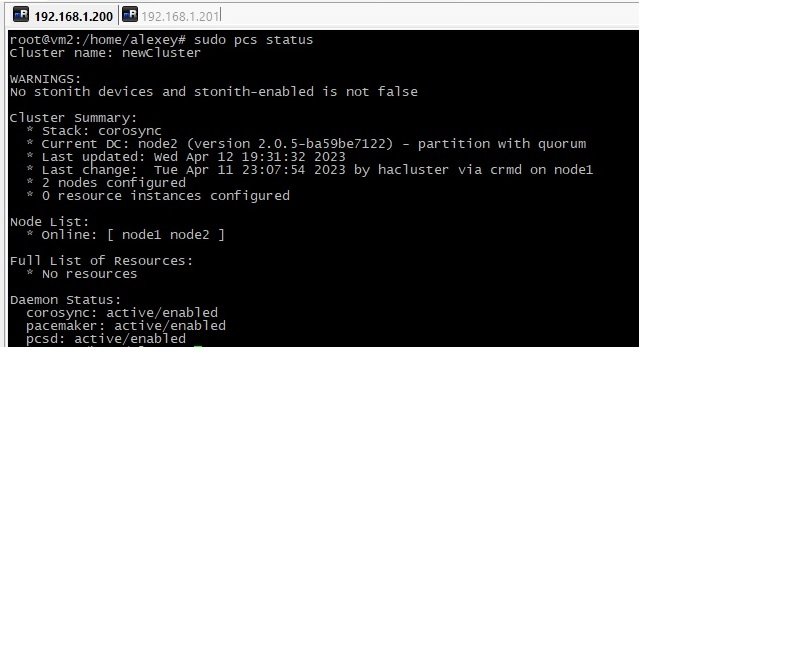
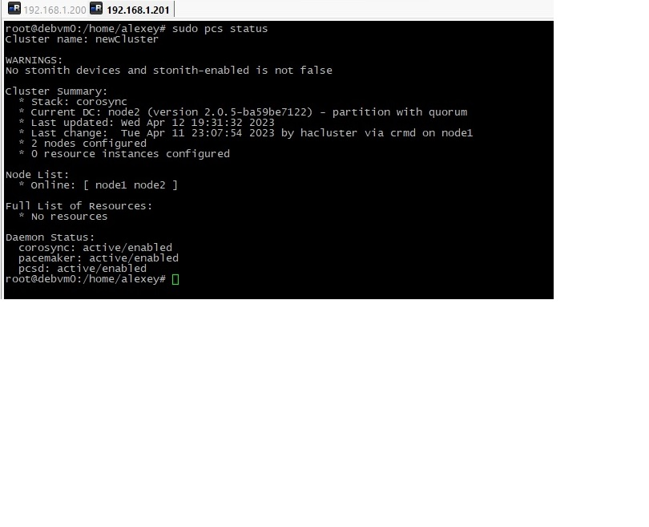
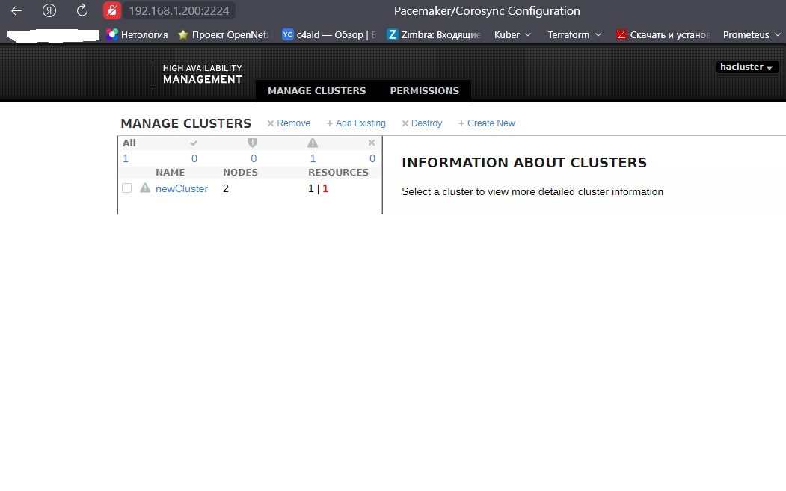
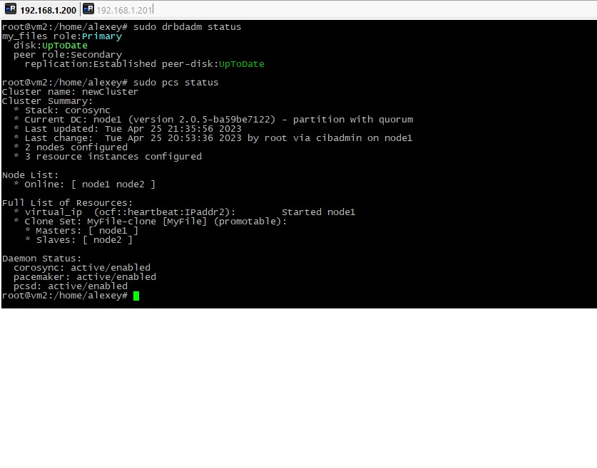
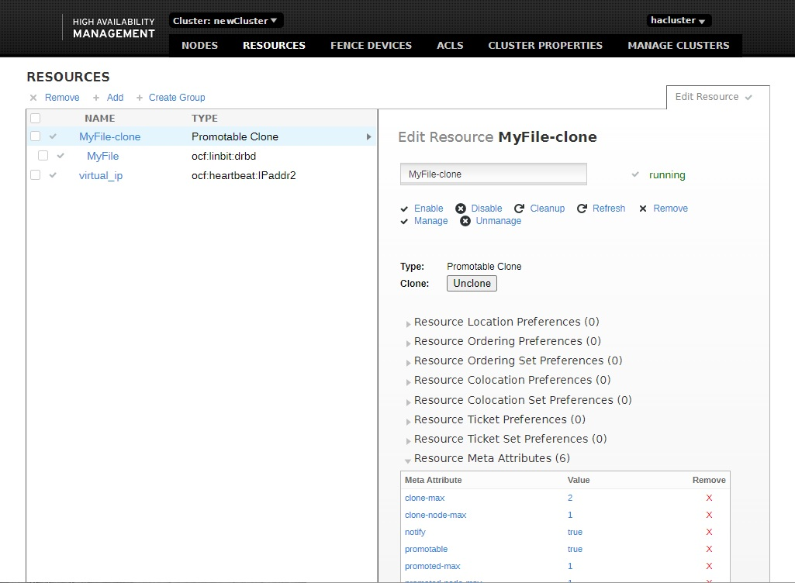

# Домашнее задание к занятию "`10.3 «Pacemaker»" - `Дьяконов Алексей`

### Задание 1. Основные функции и назначение Pacemaker.

` Pacemaker - менеджер ресурсов для кластеров высокой доступности с открытым исходным кодом. `
` Основные функции : `

1. ` Поддержка кворумных и ресурсозависимых кластеров любого размера `

2. ` Обнаружение и восстановление после сбоев `

3. `Распаковываем и копируем в необходимые директории`

4. `Независимость от систем хранения - общий диск не нужен`

5. `Кластеризовано может быть всё, что описано`

6. `Автоматическая репликация на все узлы`

7. `Поддержка Shut The Other Node In The Head (STONITH - это возможность сделать узел неспособным запускать ресурсы, даже если этот узел не отвечает на команды кластера) `

8. `Возможность задания порядка запуска ресурсов, а также их совместимости на одном узле`

9. `Поддержка расширенных типов ресурсов: клонов (запущен на множестве узлов) и с дополнительными состояниями (master/slave и т.п.) `

10. `Единые инструменты управления кластером с поддержкой сценариев `

### Задание 2. Основные функции и назначение Corosync.

`Corosync(Corosync Cluster Engine) -  проект с открытым кодом, предназначенный для создания кластеров высокой доступности, основной задачей которого является знать и передавать состояние всех узлов  `
` Основные функции : `

1. `Отслеживание состояния приложений`

2. `Оповещение приложений о смене активной ноды кластера`

3. `Отправка одинаковых сообщений процессам на всех узлах кластера`

4. `предоставление доступа к базе данных с конфигурацией и статистикой, а также отправка уведомлений о ее изменениях`

  

### Задание 3. Настройка HA-Claster (Pacemaker, Corosync,Pcs).

1. `Устанавливаем пакеты (pcs -система настройки pacemaker/corosync )`

    sudo apt install pacemaker corosync pcs

2. `Добавляем на всех узлах pcs  в автозагрузку`

    systemctl enable pcsd

3. `Изменяем пароль пользователю hacluster, созданному при установке Pacemaker`

    passwd hacluster

4. `Запускаем сервис`

    systemctl start pcsd

5. `Настраиваем аутентификацию (на одном узле, username - hacluster)`

    pcs host auth <Сервер_1> <Сервер_2>

6. `Обязательно проверить включена ли служба pcsd на обоих узлах!`

    systemctl status pcsd

7. `Запускаем ноды`

    pcs cluster setup <Название_кластера> <Сервер_1> <Сервер_2>

` И тут начались проблемы...`

    Warning: Unable to read the known-hosts file: No such file or directory: '/var/lib/pcsd/known-hosts'
    Error: Hosts 'vm0', 'vm2' are not known to pcs, try to authenticate the hosts using 'pcs host auth vm0 vm2' command
    Error: None of hosts is known to pcs.

`Но вопрос решился легко`
   
    sudo pcs cluster destroy # Хотя у меня до этого кластера не было...
    systemctl restart pcsd
    pcs host auth node1 node2
    sudo pcs cluster setup --force newCluster node1 node2

8. `Делаем все ноды активными`

    pcs cluster enable --all

9. `Добавляем все службы в автозапуск на основном сервере(? - на всех серверах и обязательно проверяем статус!)`

    systemctl enable pcsd
    systemctl enable corosync
    systemctl enable pacemaker

10. `Проверяем (или через gui (port 2224) - добавить ноду в Add Existing)`

    pcs status

-
- 
-

### Задание 4. Установка и настройка DRBD .

`Настраиваем 3 интерфейса: первый - для доступа к нодам, второй - для Heartbeat, третий - для синхронизации DRBD-ресурсов  `

1. `Ставим пакет`

    sudo apt install drbd-utils

2. `Подключаем модули ядра`

    sudo modprobe drbd
    echo “drbd” >> /etc/modules

3. `Добавляем диск (не забываем ставить lvm2)`

    lsblk
    fdisk dev/sdb1
    pvcreate /dev/sdb1
    vgcreate vg0 /dev/sdb1
    lvcreate -l 90%VG -n test vg0

4. `Создаем конфиг /etc/drbd.d/my_files.res `

    touch /etc/drbd.d/my_files.res

    resource my_files {  # имя
    protocol C; # протолол (a, b ,c)
    disk {
    fencing resource-only;
    }
    handlers {
    fence-peer
    "/usr/lib/drbd/crm-fence-peer.sh";
    after-resync-target
    "/usr/lib/drbd/crm-unfence-peer.sh";
    }
    syncer {
    rate 110M;
    }
    on vm2
    {
    device /dev/drbd2;
    disk /dev/vg0/test;
    address 192.168.123.3:7794; # ip адрес и порт синхронизации DRBD-ресурсов
    meta-disk internal;
    }
    on vm0
    {
    device /dev/drbd2;
    disk /dev/vg0/test;
    address 192.168.123.4:7794; # ip адрес и порт синхронизации DRBD-ресурсов
    meta-disk internal;
    }
    }

5. `Выполняем на обеих нодах `

    drbdadm create-md  my_files
    drbdadm up all

6. `Выполняем на первой ноде `

    drbdadm primary --force my_files

7. `Выполняем на второй ноде `

    drbdadm secondary my_files

8. `Подключаем разделы `

    mkdir /mnt/test
    mount /dev/drbd2 /mnt/test

9. `Подключаем ресурс в кластер`

    pcs create MyFile ocf:linbit:drbd drbd_resource=/dev/drbd2 op monitor interval=60s
    pcs -f drbd_cfg resource promotable MyFile promoted-max=1 promoted-node-max=1 clone-max=2 clone-node-max=1 notify=true

` Но ресурсы не стартуют...`

`Вопрос с drbd решился следующим образом:`

    apt install --reinstall drbd-utils
    sudo pcs resource update  MyFile ocf:linbit:drbd drbd_resource=my_files

`Вопрос c Ipaddr2 решился следующим образом:`

    cp /usr/lib/ocf/lib/heartbeat/* /lib/heartbeat/
    sudo pcs property set stonith-enabled=false

`В обоих случаях для дебага помогла команда:`

    sudo pcs resource debug-promote <имя_ресурса>

-
-